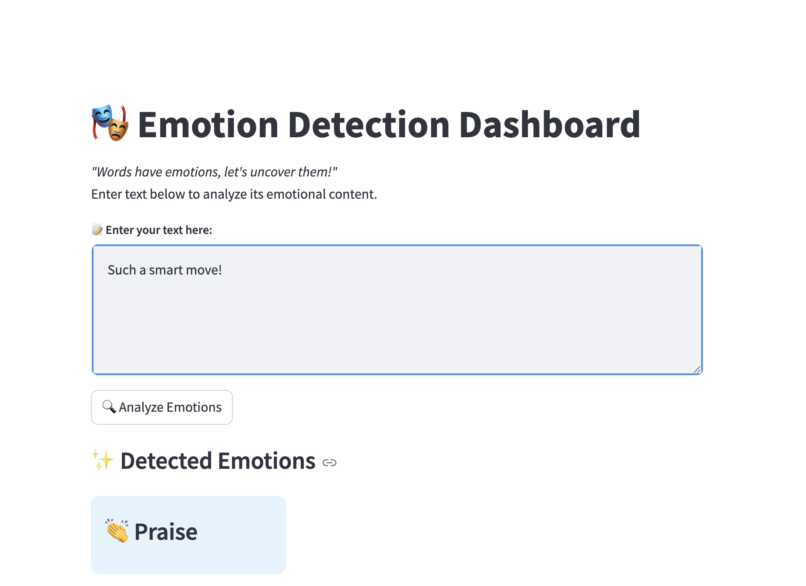

# Emotion Recognition from Text

This repository contains an end-to-end solution for recognizing emotions from text. The project leverages a fine-tuned DistilBERT model from Hugging Face to extract features from text and uses an MLP classifier with label-specific threshold adjustments to improve classification performance.

## Table of Contents

- [Overview](#overview)
- [Dataset](#dataset)
- [Installation](#installation)
- [Usage](#usage)
- [Model Training & Evaluation](#model-training--evaluation)

## Overview

The project implements a pipeline that consists of:

- **Fine-Tuning DistilBERT:** Starting with a pre-trained DistilBERT model available on Hugging Face, we fine-tune it on our emotion recognition dataset.
- **MLP Classifier with Threshold Adjustments:** The output vector from the DistilBERT model is passed to an MLP classifier. A hyperparameter search is conducted to optimize the classifier and adjust decision thresholds for each emotion label.

This two-step approach has shown measurable improvements in certain metrics, as detailed below.

## Dataset

- **Source:** The datasets were provided by the teaching assistant team as part of an ML course.
- **Availability:** The dataset files are included in the repository.

## Installation

This project is implemented in Python using the Hugging Face Transformers library and PyTorch.

1. **Clone the Repository:**

   ```bash
   git clone https://github.com/Arash-ra03/Emotion-Recognition-Using-DistilBERT.git
   cd Emotion-Recognition-Using-DistilBERT

## Usage

The project consists of two main Jupyter Notebooks:

**DistilBERT Fine-Tuning Notebook:**  
*File:* `DistilBERT_Emotion_Recognition_FineTuning.ipynb`  
*Purpose:* Fine-tune the pre-trained DistilBERT model on the provided emotion dataset.

**MLP Classification Notebook:**  
*File:* `FineTuned_DistilBERT_MLP_Classification.ipynb`  
*Purpose:* Utilize the output vectors from the fine-tuned DistilBERT model as input to an MLP classifier. This notebook includes a hyperparameter search to optimize performance and adjust thresholds for each emotion label.


## Inference

For inference, we have implemented a simple Streamlit app. This app allows users to input text and receive emotion predictions in real time.

### Running the Streamlit App

1. **Run the Streamlit App:**

   ```bash
   streamlit run emotion_app.py



## Model Training & Evaluation

### Fine-Tuning DistilBERT

**Initial Performance (Before MLP and Threshold Adjustments):**

- **F1-micro:** 0.47  
- **Accuracy:** 0.35  
- **AUC-ROC:** 0.68  
- **Precision-micro:** 0.57  
- **Recall-micro:** 0.40  

### MLP Classifier with Threshold Adjustments

**After Applying the MLP Classifier:**

- **F1-micro:** 0.53  
- **Accuracy:** 0.33  
- **AUC-ROC:** 0.87  
- **Precision-micro:** 0.48  
- **Recall-micro:** 0.59  

#### Details

- The MLP classifier receives the output vector from the fine-tuned DistilBERT model.
- A hyperparameter search is performed to find the optimal model configuration.


